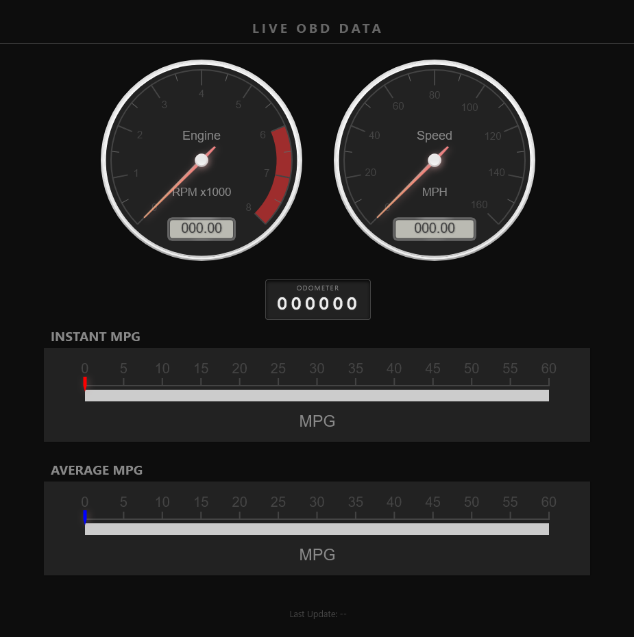

# NOTE: This is a proof of concept and takes some MacGyvering to get working
## Uses a fork of python-OBD called python-OBD-wifi that is not included in this repository

---

# Real-Time OBD-II Performance & Fuel Economy Telemetry

A Flask and Socket.IO web server that connects to a vehicle's onboard diagnostics (OBD-II) port to compute real-time telemetry—including vehicle speed, engine RPM, instant MPG, average MPG, total trip miles, and fuel consumption.

---



## Features

* **OBD-II Data Retrieval**: Interfaces with the ECU via the `python-obd` library over a network socket (IP/Port).


* **Real-Time Calculations**:
* Fuel flow rate (gallons per hour) based on Mass Air Flow (MAF) and Commanded Air-Fuel Ratio (CER).


* Instantaneous Miles Per Gallon (Instant MPG).


* Running trip average MPG and total distance traveled.


* **Volumetric Efficiency Interpolation**: Includes a bilinear interpolation engine (`getVE`) mapping RPM and MAP against a volumetric efficiency grid.


* **WebSocket Streaming**: Broadcasts telemetry packets (`obd_update`) to connected front-end clients using Flask-SocketIO at a configurable polling interval.


---

## Prerequisites

* **Python**: Version 3.8 (I think? There's a limitation on the Python version that can be used because of an architectural change in newer python versions.)


* **OBD-II Adapter**: A Wi-Fi/Ethernet OBD-II adapter connected to the target vehicle.


---

## Installation

Install required dependencies via `pip`:

```bash
pip install python-obd Flask Flask-SocketIO

```

---

## Configuration

Update the connection details and engine parameters in `main_2.py` to match your vehicle and OBD-II adapter configuration:

```python
# OBD-II Connection Settings
ip = "192.168.0.10"  # Target IP address of the Wi-Fi OBD adapter[cite: 6]
port = 35000         # Port of the OBD adapter[cite: 6]

# Vehicle Engine Parameters
ENGINE_DISPLACEMENT = 3.5  # Displacement in liters[cite: 6]
POLL_RATE = 50             # Polling interval in milliseconds[cite: 6]
UPDATE_RATE = 50           # Web update rate in milliseconds[cite: 6]

```

---

## Usage

Start the Flask-SocketIO application:

```bash
python main_2.py

```

1. The server spawns a background polling thread that connects to the OBD-II adapter at `192.168.0.10:35000`.


2. Open a web browser and navigate to `[http://127.0.0.1:5001/](http://127.0.0.1:5001/)` to view the web dashboard served from `templates/index.html`.


3. Real-time telemetry data is continuously emitted to the browser via Socket.IO events.


---

## Web Data Packet Format

The background thread emits WebSocket events named `obd_update` containing JSON objects with the following structure:

| Key | Type | Description |
| --- | --- | --- |
| `r` | `float` | Engine speed (RPM).

 |
| `s` | `float` | Vehicle speed (MPH).

 |
| `i` | `float` | Instantaneous fuel economy (MPG).

 |
| `a` | `float` | Trip average fuel economy (MPG).

 |
| `m` | `float` | Total trip distance traveled (miles).

 |
